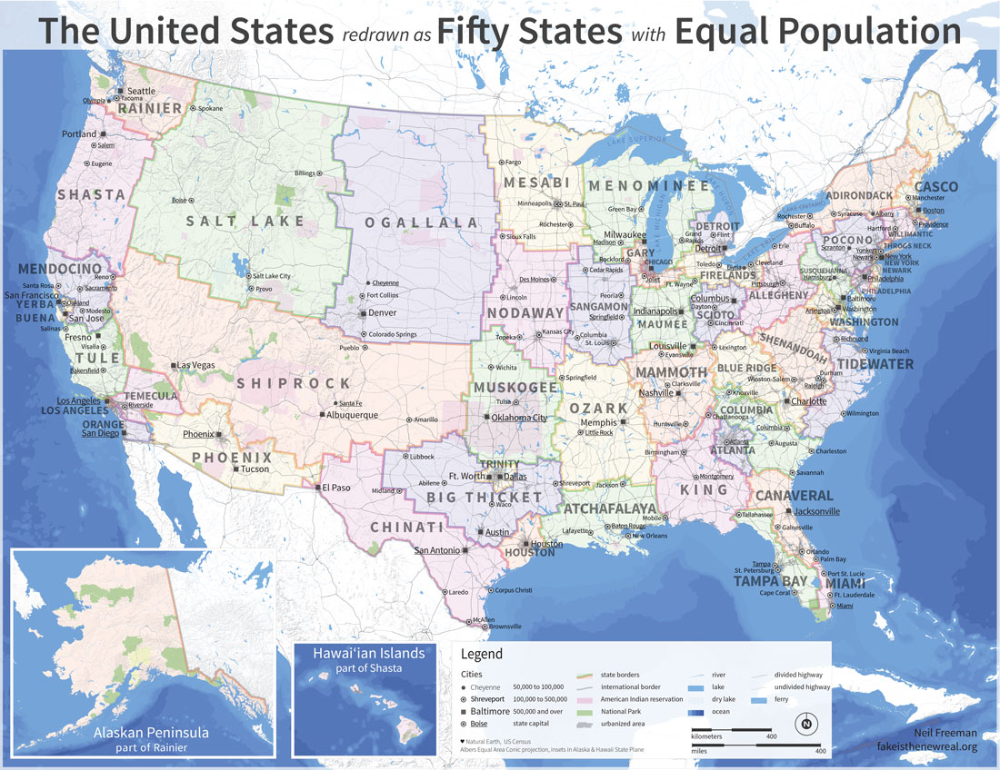
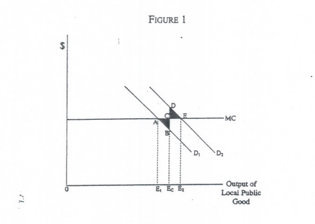
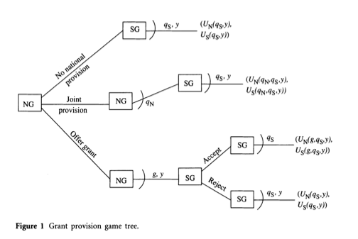
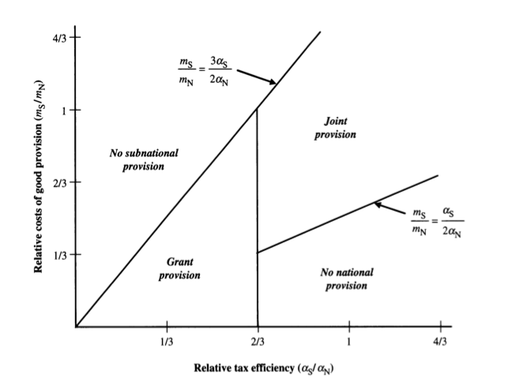

---

title       : EDUC2350 Economics of Education II
subtitle    : Economics of Federalism
author      : Jason P. Becker
job         : Harvard Strategic Data Fellow, AISR/PPSD
framework   : io2012    # {io2012, html5slides, shower, dzslides, ...}
highlighter : prettify  # {highlight.js, prettify, highlight}
hitheme     : tomorrow      # 
theme       : default
widgets     : mathjax            # {mathjax, quiz, bootstrap}
mode        : selfcontained # {standalone, draft}

---

## About Me

- Brown University 2009 ScB in Chemistry
- Brown University 2010 AM Urban Education Policy (IV)
- Rhode Island Department of Education 2010-2012
- Harvard Strategic Data Fellow at AISR and PPSD 2012-current
	- Teaching EDUC1160 Evaluating the Impact of Social Programs
- Contact: jason_becker@brown.edu

---

## Objectives
>- How can we use economics to understand federal system of governance?
>- Impetus:
	- Education is extraordinarily decentralized in some ways
	- Evolving role for the federal government, seemingly exercising more power and influence through novel mechanism
	- Evolving sector of even further decentralization of education (charter schools)
>- What does economics reveal about the new federalism in education, represented by policies like the ESEA Waivers and RTTT?

---

## Fiscal Federalism
>- How do we know who should take on government roles, the central government or decentralized government?
>- Interested in "vertical structure" of the public sector.
>- **Decentralization Theorem**: Decentralized provision of goods always leads to equal or greater utility than centralized provision at a uniform level, so long as:
  - no cost-savings from centralized provision of a good
  - no externalities that cross local jurisdictions
>- But centralized provision doesn't have to be uniform! And aren't there cost benefits to operating at scale? And don't we generally have externalities across jurisdictions?
>- Not surprising to see initial reaction is this conclusion is pretty narrow.

---

## Constraints to Centralized Provision of Public Goods
>- Why is it often useful to default to decentralized provision?
  >- Political constraints
    - Voting rules (median voter, electoral college)
    - Equity concerns (treatment, not outcomes)
    - International objectives
  >- Information constraints
    - Jurisdiction-specific costs and benefits (preferences) are not perfectly known by central planners.
    - Knowledge as a disperse good

---

## Equal Population States

---

## Evidence of Contraints to Centralization
>- Evidence of political constraints?
  - Title I funding available to virtually every congressional district, not seen as very redistributive.
  - Corn/ethanol subsidies
>- Evidence of information constraints?
  - Ever see a politician surprised when someone doesn't like their policy that's hugely popular in their jurisdiction?

---

## Fiscal Federalism Guidelines

Centralizde provision:
- Macroeconomic stabilization (inflation, monetary policy, etc)
- Redistributive policies
- "National goods", like defense. 
  - Not well-defined by Oates, but the game theory paper we read helps.

Decentralized provision:
- Goods consumed only within a local jurisdiction.
  - Greater the ration is between externalities and direct benefits, the harder it is to raise revenues local to provide the good.

---

## Constraints on Local Revenue

Local governments can't tax effecively for goods that their constituents don't receive a direct benefit for.

>- Tax avoidance through when there are low transaction costs for a mobile unit (household, person, business) and the marginal cost is greater than the marginal benefit they experience directly

---

## Magnitude of the Benefits of Decentralization

**Decentralization Theorem** + guidelines help with direction, but not magnitude.

>- Oates understanding of magnitude comes from the comparative statics
  - How different are the preferences between jurisdiction?
  - How different is the cost of providing a good in different jurisdiction?
  - Inverse with price elasticity, more vertical demand curves ($E->0$), benefit increases
  - Note: neither of these require mobility/Tiebout sorting

---

## Comparative Statics in Fiscal Federalism

---

## Mechanisms for Intergovernmental Grants
>- Matching grants when there are benefits to other jurisdictions.
  - Size of matching grant should match the size of the spillover
>- Unconditional grants to be used for equalization/redistribution
  - Although there is little evidence of this in federal policy, in education we see this between states and local governments/school districts.
  - These grants can be a more effective way to redistribute because the tax is less easily avoided than local transfers.

---

## Mechanisms for Intergovernmental Grants

- Non-monetary strings attached
  - Oates has less to say about grants that attempt to have centrally deteremined means-- seems mostly about quantity.
  - Information asymmetry might suggest local jurisdictions best know how to achieve goals.
  - Some scenarios the socially preferred method (because of externalities) is not highest marginal benefit to jurisdiction so centrally determining means might make sense.

---

## Impacts of Intergovernmental Grants

- Should be the same as increasing income by the size of the grant.
- Empircal studies show IGG with much larger impact on provision of goods than income alone.

>- Flypaper effect: money tends to stick where it lands.
>- Might posit that IGG is just a veiled tax cut.
>- Explaining the flypaper effect is important feature of federalism models
  - For now, grants (money in hand) illicits different response than money raised through direction taxation. Game theory models mentioned later help to explain why.

---

## Impacts of Intergovernmental Grants

- Asymmetry, *super flypaper*
  - Flypaper effect shows that money tends to be spend where the IGG directs it.
  - When the money is taken away, spending levels remain elevated.
  - Why?

>- Maybe people underestimate benefits of services before receiving them or overestimate the marginal cost of providing them.
>- Maybe increased spending from IGGs contribute to income inelasiticity of demand. Maybe Tiebout sorting?

---

## Race to the Bottom: A Challenge to Decentralization

>- What if decentralization is really bad because of the horizonal relationships between jurisdictions?
>- Claim: "interjurisdictional competition among decentralized levels of government introduces serious allocative distortions"
>- Competition creates a "race to the bottom" on taxation to outbid other jurisdictions for businesses and jobs. The result is overall taxation and provision of public goods is artificialy lowered.

---

## Race to the Bottom: Solutions? 

>- Maybe there is no problem. Maybe interjurisdictional competition results in enhancing efficiency through normal market mechanisms.
  - Mobile capital stock
  - Utility maximizing of local provision of public goods and revenue generation.

>- Maybe we need broader, shared taxation.
  - State property tax

---

## Education Federalism

Your turn:
- What rings true?
- How are IGGs used in education?
- What "problems" in the effective, efficient allocation of public goods do they address?
  - Is there design in agreement with some of these ideas? Are they effective?
- Who should set standards? Who should decide how to achieve these standards?
  - Equivalent quantities can be compositionally different/could be path-dependencies

---

## Game Theory for IGG

- Cooperative federalism: different levels of government work together in coordinated ways.
- Subnational government seeks guidance, funding, political coverage, etc. from the national government in order to best solve public problems.
- Treating the decisions made by the national and subnational governments in an interrelated way.
- How do we understand undersiable restrictions that national governments place on grants?
- Novel understanding of flypaper effect, asymmetry, and decisions to participate.

---

## Four Decisions
1. Offer the grant at all?
  - Could offer no grant and not enter policy space. (Zoning)
	- Could directly provide services (TSA).
2. What conditions are placed on the grants?
	- Matching funds?
	- Change local laws or regulations (drinking age)
	- Onerous reporting and maintenance of effort? (Title 1 supplement v. supplant)
3. Should a subnational government accept the money?
	- Who applies to RTTT and who doesn't?
	- Some states recieved no highway funding because of drinking age restriction.
4. How should the subnational government use the grant money?

---

## Game Theoretic Model: What Policymakers Care About

1. Policy direction
  - Do we agree with what the policy is seeking to accomplish?
	- Who gets to choose?
	- How does this align with voter preferences?

2. Credit for the policy

3. Blame for the taxation for the policy
	- Will we be blamed for having to pay for this?

---

## Definition of some terms

$U_{N}$: function of national government utility

$U_{S}$: function of subnational government utility

$q_{S}$: quantity of policy pursued by the subnational government.

$q_{N}$: quantity of policy pursued by the national government.

$y$: policy direction vector of the IGG

$x_{i}$: ideal policy vector for government $i$.

---
## Definition of some terms (cont)

$g$: size of an intergovernmental grant

$t_{i}$: taxation required by government $i$ to pay for policy.

$d$: public demand for a good/policy

$f_{i,j}$:
  - $j$ is contained ${C,B}$, where $C=cost$ and $B=benefit$
  
$m_{i}$: marginal cost of providing service at government level $i$.

$\alpha_{i}$: efficiency of taxation at government level $i$

---

## The Game

---

## Utility Equations
$$U_{i}=(q_{S} + q_{N})f_{C,i}d-(t_{S}+t_{N})^{2}f_{B,i}- \vert y-x_{i} \vert$$

$(q_{S} + q_{N})f_{C,i}d$: credit that voters give government $i$. This is consdiered to be the total quantity of that good multiplied by the fraction of credit given to government $i$ and the public demand for that policy.

$(t_{S}+t_{N})^{2}f_{B,N}$: blame received for a policy, represented by the total taxation to pay for the policy squared (because Americans hate taxes!) multiplied by the fraction of the blame for government $i$.

$t_{i}=\frac{q_{i}m_{i}}{\alpha_{i}}$: taxing at level $i$ is based on how much it costs to provide a good over the efficiency of taxation.

$\vert y-x_{i} \vert$: the difference between government $i$'s ideal policy, $x_{i}$ and the policy direction of the intergovernmental policy, $y$.

---

## Playing the Game

Results are hard to read and understand if are not used to reading these papers, but if you use the appendix, it's all simple algebra and a little bit of derivatives to find maximums. Best not to interepret directly and just look for what terms are in the numerator and denominator and the "order" of these terms (what power they're raised to).

---

## Subgame Results

### No National Provision
- National government experiences some disutility due to the difference between the policy enacted and their ideal policy.
- Subnational government gets their ideal policy direction, and will increase quantity based on increasing demand and efficiency and decrease quantity based on increased marginal cost.

### Joint Provision
- Higher demand, higher quantity.
- Cost differences between levels impacts provision by level.
  - Lower cost relative to the other level means greater quantity supplied.
- Tax efficiency operates just like cost.
- How does is this story derived from the credit/blame assumption?

--- &twocol

## IGG Subgame

The quantity when the grant is accepted increases by:
$$\frac{g(2\alpha_{N}-\alpha_{S})}{2m_{s}\alpha_{N}}$$

***left

No National Provision (state declines grant)

$$\frac{d^{2}\alpha_{S}^{2}}{4m_{S}^{2}}$$

***right

Accepts the Grant

$$\frac{d\alpha_n\alpha_{S}^{2} + gm_{s}(2\alpha_{N}-\alpha_{s})}{2m_{S}^{2}\alpha_{N}}$$

---

## Proposition 1

> "The quantity of goods provided by a grant-receiving government increases in 
> proportion to the size of the grant received. The effect of the grant is greater in
> regions where the costs of good provision are low, and where the subnational 
> government is inefficient in raising taxes, relative to the national government.""

---

## Proposition 2

> "All else equal, subnational governments will accept grants when: (a) the policy 
> constraints imposed in the grant conditions are small, (b) the size of the grant is 
> large, (c) the subnational government is not able to raise taxes efficiently, (d) 
> the cost of good provision are large, and (e) public demand is low."

(e) is a pretty weird finding. Grants are less likely to be accepted if demand is low? The rationale provided is that subnational governments don't want to share credit where demand is sufficiently high.

---

## Proposition 3

> "All else equal, grant size will be larger when: (a) public demand for spending on the good is high, (b) costs of good provision by the subnational government are low, and (c) the national government is able to raise taxes efficiently."

>- Notice, there is no need for coordination/cooperation. 

---

## Proposition 4

> "All else euqal, mandates on grant recepients are more restrictive when: (a) public demand for spending on the good is high, (b) costs of good provision by subnational government is low, (c) the national govenrment is able ot raise taxes efficiently, and (d) the subnational government is not able to raise taxes efficiently."

(d) is the new step from Proposition 3.

>- Why? 

---

## Proposition 5

---

## Flypaper Effect Revisited

We found that IGG increases spending:
$$\frac{g(2\alpha_{N}-\alpha_{S})}{2m_{s}\alpha_{N}}$$

>- An income effect would say $\frac{g}{m_{S}}$.
>- This is only true when $\alpha_{s}=0$ in the result.

### Implications
>- Stronger flypaper effect where the efficiency of state government to raise taxes is low.
>- However, we also found (Proposition 3) that the national government provides IGGs in areas where the subnational government would likely increase spending anyway, which would look like a flypaper effect.

---

## Asymmetry

>- Some conditions lead both governments to change provisions in the same direction
  - demand
  - cost
>- Others may lead to inverse relationships
  - tax efficiency

### Implications
> "If a grant program is establihsed in response to increased public demand in a given program area, but cut back or abandoned in response to a decrease in the national government's relative ability to raise taxes, then such an asymmetric response to changing grant conditions might occur."

---

## Grant Acceptance

- Subnational government without substantial tax base/ability to raise revenue will under-fund desired activities.
- IGGs are attractive so they can increase high demand goods.
- Subnational governments with greater costs and low public demand also like IGGs.
  - High cost of living.
  - "This is a safe community."
  - Low demand for cops, but high salaries. Significant blame, low demand.
  - Would love IGG to provide additional officers

---

## Grant Restrictions

- Larger grants can come with greater restrictions.
- Why do states sometimes ask for smaller grants with fewer restrictions?
  - Their ability to raise revenues increases relative to the federal government, so they'd rather pursue policies more in line with their ideal
  - Federal government will do this if they are revenue constrained and demand is low, therefore there is little credit and lots of blame.

--- 

## Federalism in Education

Two groups: Race to the Top, No Child Left Behind

Both of these are IGGs.

1. Why offer the grant at all?
2. Why make these grants conditional?
3. Should a subnational government accept the money?
  - Size, restrictions, costs (national v. states), efficiency (national versus state), policy direction, credit/blame, demand...

---
